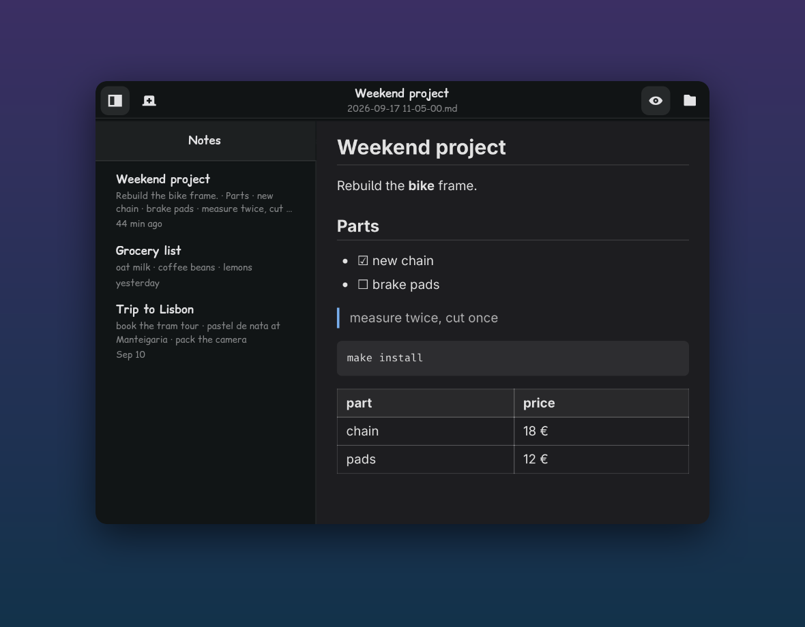

# jot

A tiny autosaving notes editor for Linux desktops, built with GTK4 and libadwaita.



Press a key, type, press <kbd>Esc</kbd>. It saves as you type.

- **No save dialogs.** Every note is saved as you type to `~/Documents/Notes/<date time>.md`.
- **Always fresh.** Each launch opens a blank tab, and old notes never reopen. If jot is
  already open, launching it again adds a new tab.
- **Empty notes leave nothing behind.** If you clear a note, its file is deleted.
- **Browse your notes** in a sidebar, newest first, with a short preview of each. Click one to
  keep editing it.
- **Rendered Markdown** at the press of a button: headings, lists, task boxes, quotes, code,
  tables. JavaScript is off and raw HTML in a note is shown as text.
- **Tabs**, Markdown highlighting, and it follows the system light/dark theme.

## Keys

| Key | Action |
|---|---|
| <kbd>Ctrl</kbd>+<kbd>T</kbd> / <kbd>Ctrl</kbd>+<kbd>N</kbd> | New note |
| <kbd>Ctrl</kbd>+<kbd>O</kbd> | Show / hide the notes sidebar |
| <kbd>Ctrl</kbd>+<kbd>E</kbd> | Toggle rendered Markdown |
| <kbd>Ctrl</kbd>+<kbd>W</kbd> | Close note (closing the last one exits) |
| <kbd>Esc</kbd> / <kbd>Ctrl</kbd>+<kbd>Q</kbd> | Close jot |
| <kbd>Ctrl</kbd>+<kbd>Tab</kbd>, <kbd>Ctrl</kbd>+<kbd>PgUp</kbd>/<kbd>PgDn</kbd>, <kbd>Alt</kbd>+<kbd>1…9</kbd> | Switch tabs |

## Install

Requires Python 3, PyGObject, GTK 4, libadwaita and GtkSourceView 5. The rendered view also
needs WebKitGTK 6 and Python-Markdown; without them jot still works and the preview button is
hidden.

```sh
# Arch
sudo pacman -S python-gobject libadwaita gtksourceview5 webkitgtk-6.0 python-markdown
curl -Lo ~/.local/bin/jot https://raw.githubusercontent.com/omeg4-dev/jot/main/jot.py
chmod +x ~/.local/bin/jot
```

Set `JOT_DIR` to store notes somewhere else.

### Hyprland

```lua
hl.bind("SUPER + CONTROL + C", hl.dsp.exec_cmd("jot"))
hl.window_rule({ match = { class = "^(dev\\.omega\\.jot)$" }, float = true, center = true, size = "720 520" })
```

## Tests

```sh
python -m pytest -q
```

## License

MIT
